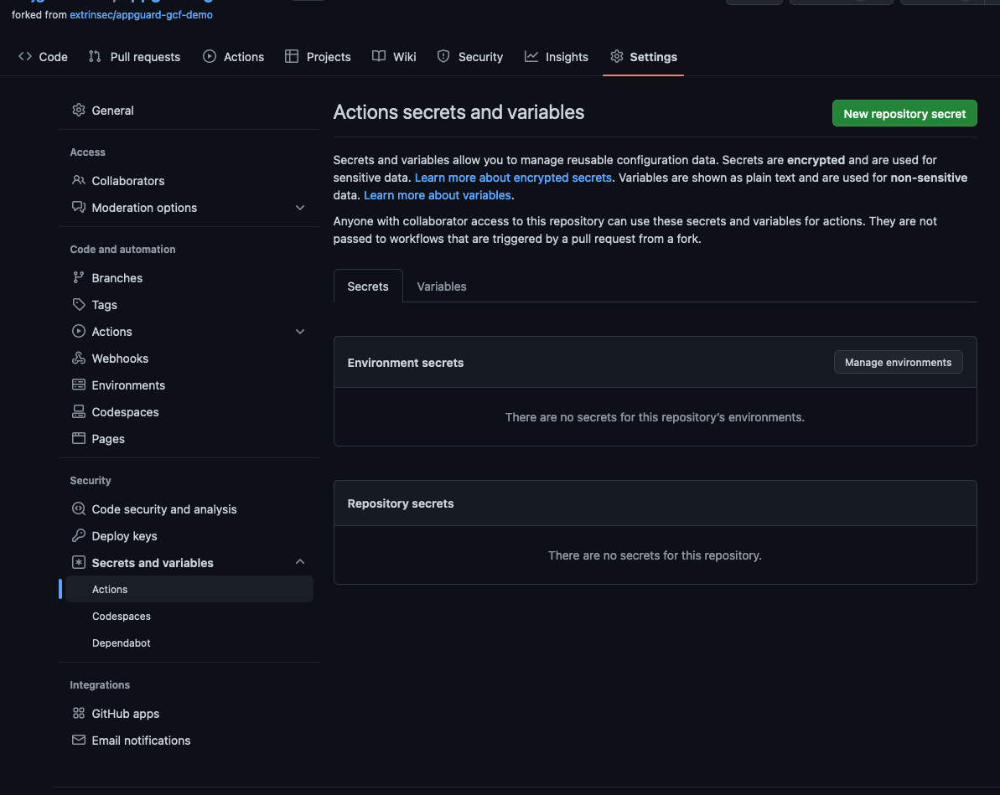

## Configure GCF for Github Actions deployment

There are many ways to deploy your code to Google Cloud Functions, e.g. via [Serverless](https://www.serverless.com/framework/docs/providers/google) or using [Google Cloud CLI](https://cloud.google.com/functions/docs/deploy).  What is shown here is a [sample shell script](scripts/github_actions_auth.sh) to configure a new GCP project, in order to deploy functions through Github Actions.  Here are the steps to use it:

1. create a new GCP project with Billing enabled
1. have a gcloud CLI [installed](https://cloud.google.com/sdk/docs/install) and [initialized](https://cloud.google.com/sdk/docs/initializing) (the below script will create and authorize a new service account for GCF)
1. set environment variables for the shell script
   ```console
   $ export YOUR_PRJECT_ID=<new gcloud project id>
   $ export YOUR_FORKED_GITHUB_REPO_NAME=<your forked github repo name, e.g. user/project or org/project>
   ```
1. run the script
   ```
   $ cd scripts
   $ ./github_actions_auth.sh
   ```
1. notice the last two variables printed from the script and set them as Github Actions repo secrets
   1. go to the "Settings" tab of your Github repo, and then expand the "Secrets and variables" menu item on the left under "Security", select "Actions"
   1. click on "New repository secret" at the top to create two items for ` GCP_WORKLOAD_IDENTITY_PROVIDER_REF` and `GCP_SERVICE_ACCOUNT_EMAIL`, using the values from the previous script as secret
   
   1. use these secrets in your Github workflow file, e.g.
   ```
      steps:
        - id: 'auth'
          uses: 'google-github-actions/auth@v1'
          with:
            workload_identity_provider: "${{ secrets.GCP_WORKLOAD_IDENTITY_PROVIDER_REF }}"
            service_account: "${{ secrets.GCP_SERVICE_ACCOUNT_EMAIL }}"
   ```